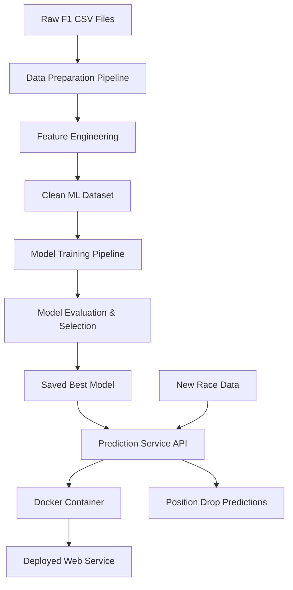

# Design Document

## Overview

The F1 Performance Drop Predictor is a machine learning system that analyzes historical Formula 1 data to predict when cars will finish worse than their qualifying position due to mechanical stress and reliability issues. The system combines comprehensive F1 datasets, feature engineering focused on car stress indicators, multiple ML models, and a containerized web service for real-time predictions.

## Architecture



The system follows a traditional ML pipeline architecture with clear separation between data preparation, model training, and inference serving. All components are designed to be reproducible and containerized for easy deployment.

## Components and Interfaces

### Data Preparation Module (`src/data_prep.py`)
- **Input:** Raw CSV files from F1 database (races, results, drivers, constructors, pit stops, etc.)
- **Output:** Clean unified dataset (`data/f1_performance_drop_clean.csv`)
- **Key Functions:**
  - `load_raw_data()`: Loads and validates all CSV files
  - `merge_datasets()`: Joins race results with qualifying, pit stops, and metadata
  - `compute_targets()`: Creates both classification and regression targets
  - `save_clean_dataset()`: Exports processed data for ML pipeline

### Feature Engineering Module (`src/features.py`)
- **Input:** Merged raw data from data preparation
- **Output:** ML-ready feature matrix with engineered variables
- **Key Features:**
  - **Stress Indicators:** Pit stop frequency, pit duration variance, qualifying gap to pole
  - **Historical Reliability:** Driver DNF rate, constructor reliability score (last 10 races)
  - **Track Characteristics:** Circuit type (street/permanent), track length category
  - **Performance Context:** Grid position, championship standings position
  - **Experience Metrics:** Driver career starts, seasons active, age

### Model Training Module (`src/train.py`)
- **Input:** Feature matrix and targets from feature engineering
- **Output:** Trained models, evaluation metrics, feature importance
- **Model Pipeline:**
  1. **Baseline Models:** Logistic regression (classification), linear regression (regression)
  2. **Tree-Based Models:** Decision tree, random forest with hyperparameter tuning
  3. **Gradient Boosting:** XGBoost/LightGBM with cross-validation
  4. **Model Selection:** Best model based on validation performance
- **Evaluation Strategy:** Time-aware 80/20 split, 5-fold cross-validation, multiple metrics

### Prediction Module (`src/predict.py`)
- **Input:** Trained model and new race parameters
- **Output:** Position drop predictions (both classification probability and regression value)
- **Functions:**
  - `load_model()`: Loads saved model and preprocessing pipeline
  - `predict_single()`: Single race prediction
  - `predict_batch()`: Batch predictions for multiple scenarios
  - `validate_input()`: Input validation and error handling

### Web Service Module (`src/serve.py`)
- **Framework:** FastAPI for modern async API with automatic documentation
- **Endpoints:**
  - `POST /predict`: Single prediction endpoint
  - `POST /predict_batch`: Batch prediction endpoint
  - `GET /health`: Health check endpoint
  - `GET /model_info`: Model metadata and feature importance
- **Input Format:** JSON with race parameters (driver_id, constructor_id, grid_position, etc.)
- **Output Format:** JSON with classification probability, regression value, and confidence intervals

## Data Models

### Input Data Schema
```python
RaceInput = {
    "driver_id": int,
    "constructor_id": int, 
    "grid_position": int,
    "circuit_id": int,
    "season": int,
    "driver_experience": int,  # career starts
    "recent_reliability": float,  # team DNF rate last 10 races
    "qualifying_gap": float,  # seconds behind pole
    "pit_stop_history": List[float]  # recent pit durations
}
```

### Feature Matrix Schema
```python
Features = {
    "grid_position": float,
    "driver_experience_years": float,
    "driver_dnf_rate": float,
    "constructor_reliability_score": float,
    "qualifying_gap_to_pole": float,
    "avg_pit_duration_last_5": float,
    "pit_frequency_last_10": float,
    "track_type_encoded": int,
    "championship_position": float,
    "age_normalized": float
}
```

### Prediction Output Schema
```python
PredictionOutput = {
    "classification": {
        "will_drop_position": bool,
        "probability": float,
        "confidence": str  # "high", "medium", "low"
    },
    "regression": {
        "expected_position_change": float,
        "prediction_interval": [float, float]
    },
    "feature_contributions": Dict[str, float],
    "model_version": str
}
```

## Error Handling

### Data Pipeline Errors
- **Missing Data:** Log warnings, use forward-fill for time series, drop rows with critical missing values
- **Data Quality Issues:** Validate ranges (positions 1-20, reasonable lap times), flag outliers
- **File Access:** Graceful handling of missing CSV files with clear error messages

### Model Training Errors
- **Convergence Issues:** Implement fallback to simpler models, adjust hyperparameters
- **Memory Constraints:** Batch processing for large datasets, feature selection if needed
- **Performance Thresholds:** Fail training if baseline performance not met, log detailed diagnostics

### API Service Errors
- **Invalid Input:** Comprehensive validation with specific error messages
- **Model Loading:** Retry mechanism, fallback to cached predictions
- **Resource Limits:** Request rate limiting, timeout handling
- **Prediction Failures:** Return confidence intervals, flag uncertain predictions

## Testing Strategy

### Unit Tests
- **Data Processing:** Test each transformation function with known inputs/outputs
- **Feature Engineering:** Validate feature calculations with manual examples
- **Model Functions:** Test prediction consistency, input validation
- **API Endpoints:** Test all endpoints with valid/invalid inputs

### Integration Tests
- **End-to-End Pipeline:** Raw data → features → model → predictions
- **Docker Container:** Build and run container, test API accessibility
- **Data Consistency:** Verify same results across different runs (with fixed seeds)

### Performance Tests
- **Model Training Time:** Ensure training completes within reasonable time (< 10 minutes)
- **Prediction Latency:** API responses under 200ms for single predictions
- **Memory Usage:** Monitor memory consumption during training and serving
- **Accuracy Benchmarks:** Maintain minimum performance thresholds

### Validation Tests
- **Historical Validation:** Test predictions on known historical outcomes
- **Cross-Validation:** Ensure consistent performance across different data splits
- **Feature Importance:** Validate that important features make domain sense
- **Edge Cases:** Test with extreme values, missing data, unusual race scenarios

## Deployment Architecture

### Local Development (Conda + Kiro)
```bash
# Environment setup
conda create -n f1-predictor python=3.9
conda activate f1-predictor
pip install -r requirements.txt

# Development workflow
python src/data_prep.py
python src/train.py
python src/serve.py
```

### Containerized Deployment (Docker + Colima)
```dockerfile
FROM python:3.9-slim
COPY requirements.txt .
RUN pip install -r requirements.txt
COPY src/ /app/src/
COPY models/ /app/models/
WORKDIR /app
EXPOSE 8000
CMD ["python", "src/serve.py"]
```

### Production Considerations
- **Model Versioning:** Save models with timestamps, maintain model registry
- **Monitoring:** Log prediction requests, track model performance drift
- **Scaling:** Stateless design allows horizontal scaling
- **Security:** Input validation, rate limiting, API key authentication (optional)

## Technology Stack

### Core Dependencies
- **Data Processing:** pandas, numpy for data manipulation
- **Machine Learning:** scikit-learn, xgboost, lightgbm for modeling
- **Web Framework:** FastAPI with uvicorn for high-performance API
- **Containerization:** Docker with multi-stage builds for efficiency
- **Development:** Jupyter notebooks for exploration, pytest for testing

### Development Environment
- **IDE:** Kiro with integrated terminal and debugging
- **Package Management:** Conda for environment isolation
- **Container Runtime:** Colima for Docker on macOS
- **Version Control:** Git with clear commit messages and branching strategy

This design provides a robust, scalable foundation for the F1 performance prediction system while maintaining simplicity for educational purposes and grader evaluation.